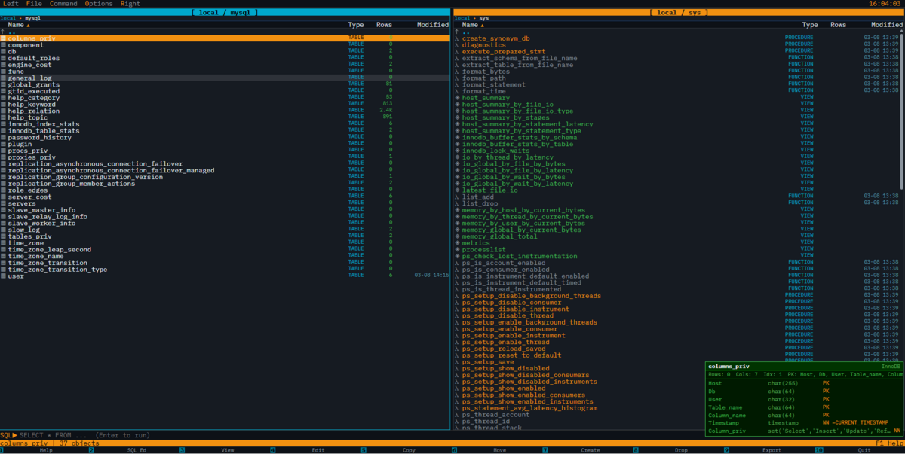
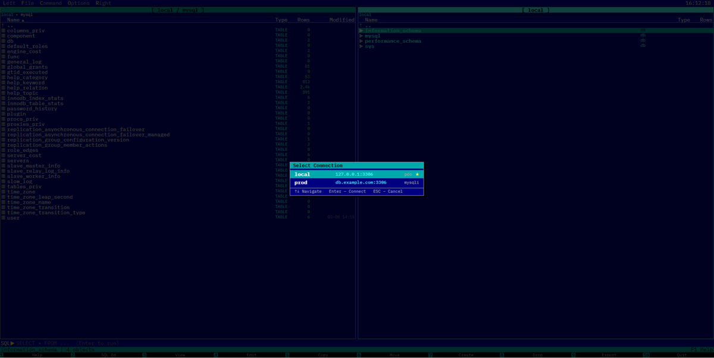
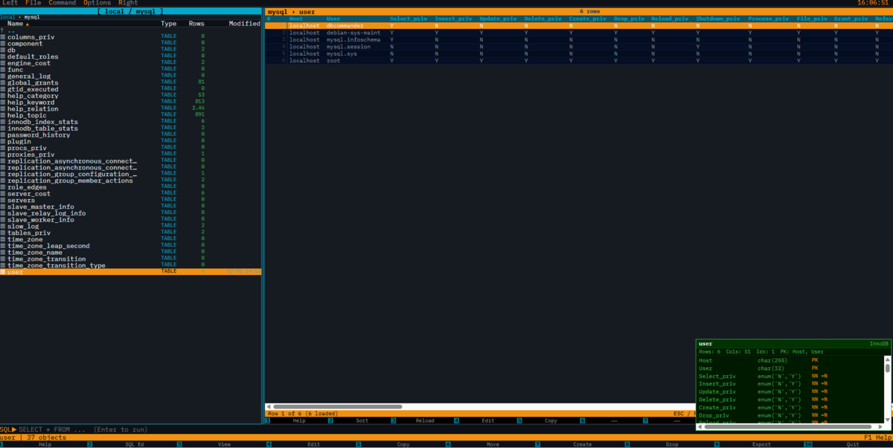
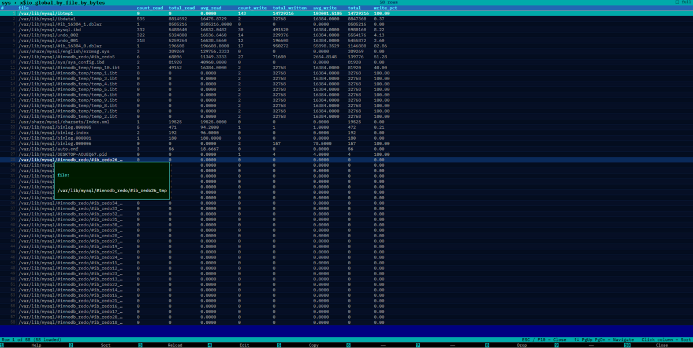
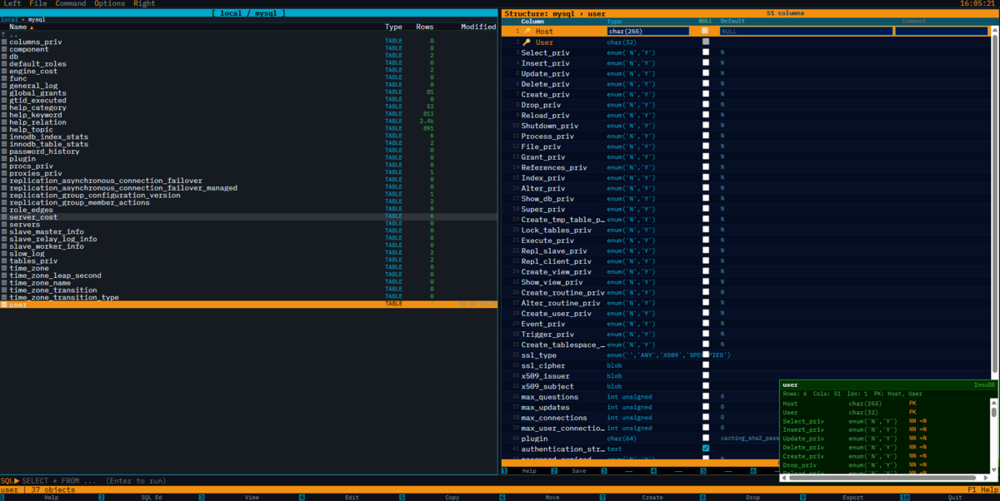
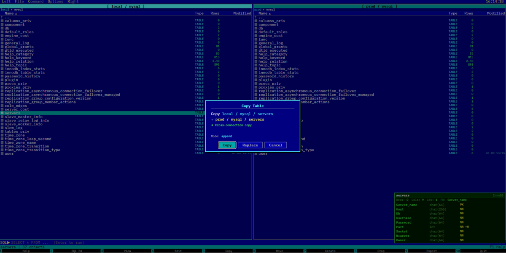
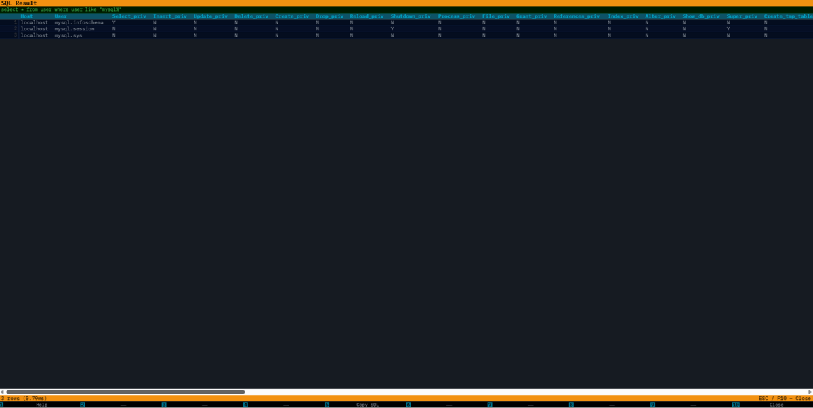

# DBCommander

A Norton Commander-style MySQL manager – dual-panel, keyboard-driven, built on [Curlpit](https://github.com/curlpit/curlpit).

## What it is

DBCommander brings the classic two-panel file manager experience to MySQL. Navigate databases, tables, and rows with the keyboard, run SQL from a command line, view and edit rows inline, copy tables across connections – all in a browser, all without leaving the keyboard.

## Screenshots


*Dual-panel layout – each panel has its own connection, database, and cursor*


*Connection picker – switch connections per panel independently*


*F3 Row Viewer – paginated rows with quick structure info*


*F3 Row Viewer fullscreen – cell expand on hover*


*F4 Structure Editor – column definitions, types, nullability, defaults*


*F5 Copy – batch copy across databases and connections*


*F2 SQL Editor – run arbitrary SQL, full-screen result viewer*

## Features

- **Dual-panel layout** – each panel has its own independent connection, database, and cursor
- **Multiple connections** – switch connections per-panel via the title bar or Left/Right menu; cross-connection table copy works out of the box
- **Keyboard-first** – full NC-style navigation, F-key bar, Tab to switch panels
- **F3 Row Viewer** – infinite scroll, column sort, cell expand, full-screen or panel-mode
- **F4 Structure Editor** – edit column types, nullability, defaults inline
- **F5 Copy** – batch copy tables between databases or connections, append or replace mode
- **F8 Drop** – drop tables and views with confirmation
- **F9 Export** – CSV, JSON, or SQL INSERT, up to 50k rows
- **F2 SQL Editor** – run arbitrary SQL, full-screen result viewer
- **Themes** – Norton Commander classic and DBCommander dark

## Requirements

- PHP 8.1+
- MySQL 5.7+ / 8.0+
- Apache or Nginx with mod_rewrite / try_files
- Composer

## Installation

```bash
git clone https://github.com/curlpit/dbcommander
cd dbcommander
composer install
cp config/connections.json.example config/connections.json
# edit config/connections.json
```

Point your web server's document root at `public/`.

## Configuration

```json
{
  "connections": {
    "local": {
      "driver":   "pdo",
      "host":     "127.0.0.1",
      "port":     3306,
      "user":     "root",
      "password": "",
      "charset":  "utf8mb4"
    },
    "prod": {
      "driver":   "mysqli",
      "host":     "db.example.com",
      "port":     3306,
      "user":     "dbuser",
      "password": "secret",
      "charset":  "utf8mb4"
    }
  },
  "default": "local"
}
```

Both `pdo` and `mysqli` drivers are supported.

## API endpoints

| Method | Path | Description |
|--------|------|-------------|
| GET | `/api/connections` | List configured connections |
| GET | `/api/databases` | List databases |
| GET | `/api/databases/{db}/tables` | List tables, views, routines, triggers |
| GET | `/api/tables/{db}/{table}/rows` | Paginated row list |
| GET | `/api/tables/{db}/{table}/structure` | Column definitions |
| POST | `/api/sql` | Run arbitrary SQL |
| POST | `/api/copy` | Batch copy table between databases/connections |
| PUT | `/api/tables/{db}/{table}/rows` | Update a row |
| PUT | `/api/tables/{db}/{table}/structure` | Modify a column |
| DELETE | `/api/tables/{db}/{table}` | Drop table or view |

Connection is selected via the `X-Connection` request header. For copy operations, `X-Connection-Target` selects the target connection.

## Built on

[Curlpit](https://github.com/curlpit/curlpit) – PSR-15 middleware orchestrator. The routing, dispatch, connection resolution, and cross-connection copy loop are all expressed as a declarative middleware flow in `src/App/Config/middleware.json`.

## License

MIT
